# Минималистичная платформа для мониторинга дрейфа данных

Данная платформа используется как во время практической части по мониторингу, так и при выполнении домашнего задания. Платформа состоит из 4 составных частей:

* Airflow - планировщик задач;
* Grafana - дашборды и алертинг;
* Prometheus - хранилище данных;
* Stateful Monitor - экран который отображает статистику для мониторинга. 

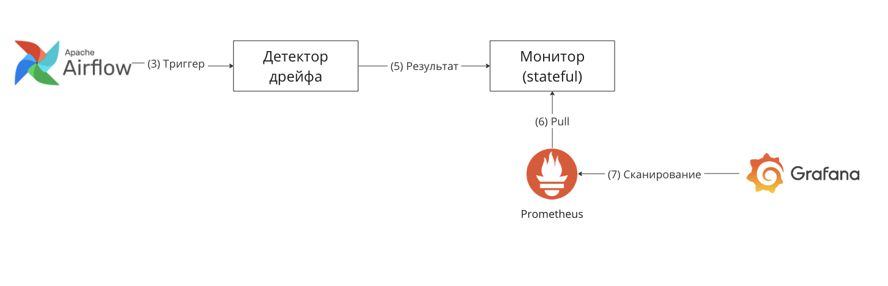

Для развертывания системы требуется выполнить следующую команду ```docker-compose up``` в директории __5.practice/__.

### Домашнее задание

На практической части блока мы реализовали пакетную систему мониторинга дрейфа данных и настроили для нее оповещения в Телеграм. Вам потребуется улучшить наше решение и реализовать продвинутую систему отправки оповещений.

В текущем варианте системы мониторинга мы использовали подход к генерации оповещений на базе статистик. В рамках этого подхода руками задается максимально допустимое отклонение метрики, и если метрика пересекает эту границу - отправляется оповещение. Хотелось бы вообще избежать ручного подбора коэффициентов и максимально все автоматизировать. Для этого вам потребуется реализовать с помощью стат тестов (в пакете scipy / evidently / иное) механизм обнаружения дрейфа данных. 

Ваша задача заключается в том чтобы изменить код метода ``apply_detection`` в ДАГе Airflow, реализовав там проверку наличия дрейфа на базе статистического теста, который возвращает p-value. Со стороны Grafana - вам потребуется сделать генерацию алерта при условии что p-value < 0.05. Критерием успеха домашнего задания будет написанный рабочий код и уведомление об алерте от вашего телеграм бота в специальном чате (потребуется скриншот с временной меткой).


### Практика

**Шаг 1. Первичные настройки**
1. Выполняем ```docker-compose up``` и убеждаемся что сервис корректно стартовал.
2. Заходим в UI планировщика Airflow (http://0.0.0.0:8080/) и в качестве пользователя и пароля вводим airflow.
3. Раскомментим bike_sharing_dataset_3.csv и запустим даг __simple_detector__.
4. Проверим что метрики сохранились в сервисе __Stateful Monitor__. Для этого вызовем в терминале ```curl http://0.0.0.0:5445/metrics```.
5. Заходим в Grafana (http://0.0.0.0:3000/) и в качестве пользователя и пароля вводим admin.

**Шаг 2. Настраиваем соединение Grafana и Prometheus**
1. Кликаем в табике слева "Connections" -> "Add new connection".
2. Набираем Prometheus, щелкаем по Prometheus.
3. Жмем в правом верхнем углу "Add new data source"
4. В настройках вводим URL http://prometheus:9090
5. Жмем "Save & test" в самом конце.

**Шаг 3. Добавляем дашборд**
1. Заходим во вкладку Dashboards в табике слева.
2. Нажимаем "Create Dashboard" -> "Add visualization" -> "Prometheus".
3. Выставляем конфигурацию как на скрине.
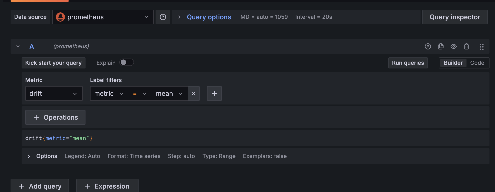
4. Вводим название графика и жмем "Apply", как показано на скрине.
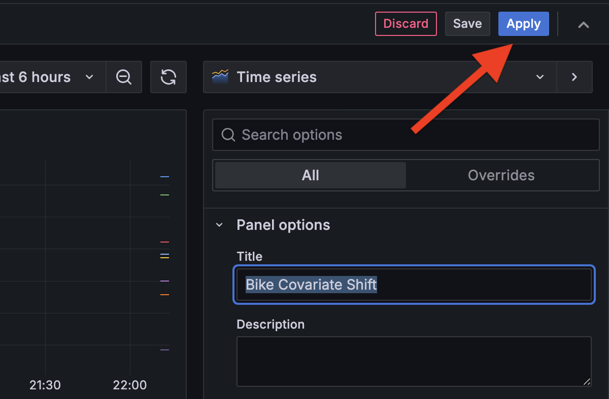
5. Жмем на знак дискеты (скрин), вводим название дашборда "Data Drift".
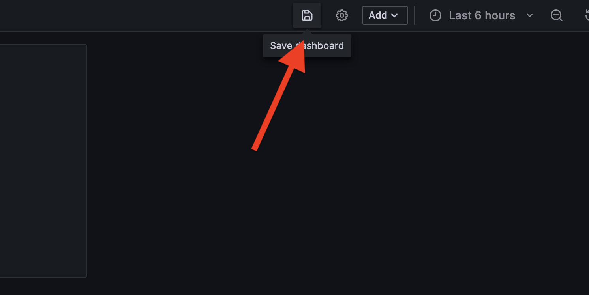
6. Проверяем что новый дашборд "Data Drift" доступен во вкладке Dashboards.

**Шаг 4. Настраиваем алертинг**
1. Добавим новую точку оповещения в виде телеграм бота. Для этого в табике слева выбираем "Alerting" -> "Concat points".
2. Выставляем конфигурацию как в примере на скрине. Выставляйте свой Chat ID, тот что указан в примере - не существующий. Жмем на кнопку Test и проверяем что сообщение пришло в чат с соответствующим Chat ID.
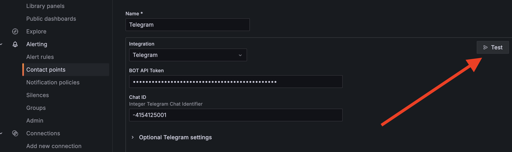

**Шаг 5. Добавляем правило для отправки алерта**
1. Заходим в левом табике во вкладку "Alerting" -> "Alert rules".
2. Нажимаем на кнопку "New alert rule".
3. Выбираем название для правила, и выбираем на какую метрику будет смотреть алертинг. Пример на скриншоте ниже.
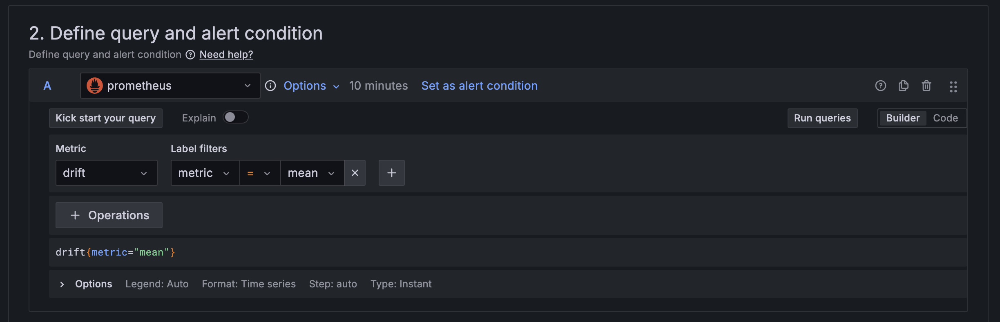
1. Указываем что смотреть надо на последнюю (Last) запись метрики, и алертить при ее значении менее -20 (в рамках самостоятельной работы - сделайте проверку на условие более 20). Пример на скриншоте.
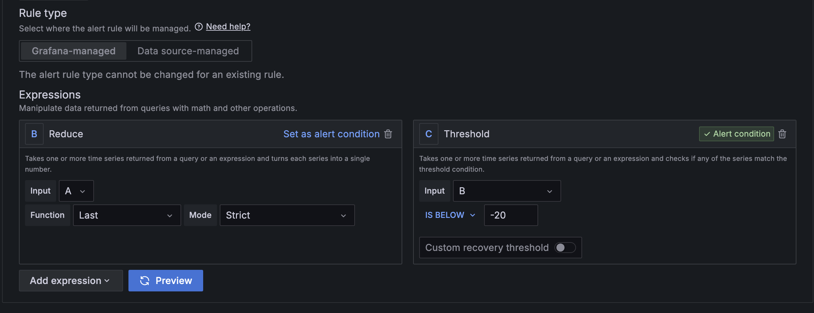
1. В пункте "Set evaluation behavior" выставим "Pending period" значение 10s. Это означает что правило будет проверяться каждые 10 секунд. Остальные значения выставляем в соответствии со скриншотом ниже.
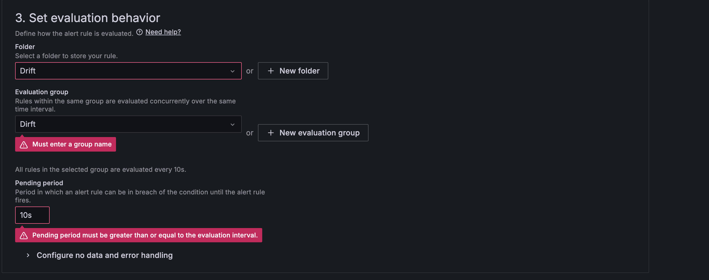
1. Просим в случае срабатывания правила выставить метку drift_threshold_detected в значение true.
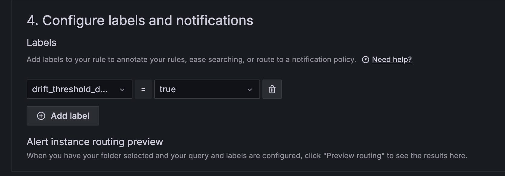
1. При желании меняем шаблон оповещения в разделе "Add annotations".
2. Далее нажимаем "Save rule and exit".

**Шаг 6. Настраиваем политики оповещения**
1. Заходим в левом табике во вкладку "Alerting" -> "Notification policies".
2. Нажимаем "New nested policy" и заполняем данные в окне по аналогии со скришнотом.
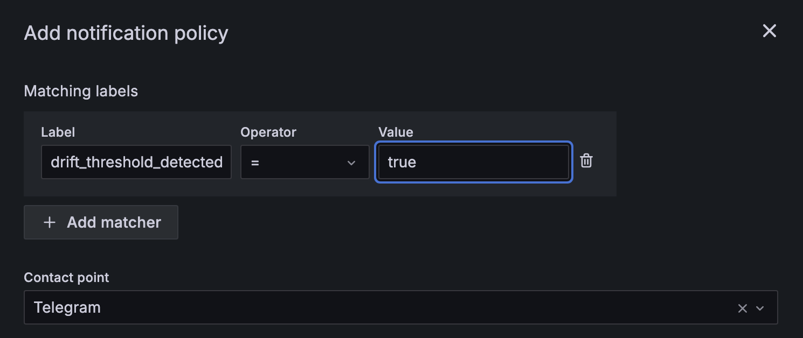
3. Жмем "Save policy"

**Шаг 7. Проверяем оповещения**
1. Переименовываем набор данных "bike_sharing_dataset_4.csv.off" -> "bike_sharing_dataset_4.csv".
2. Запускаем ДАГ "simple_detector".
3. Проверяем на дашборде что метрики изменились
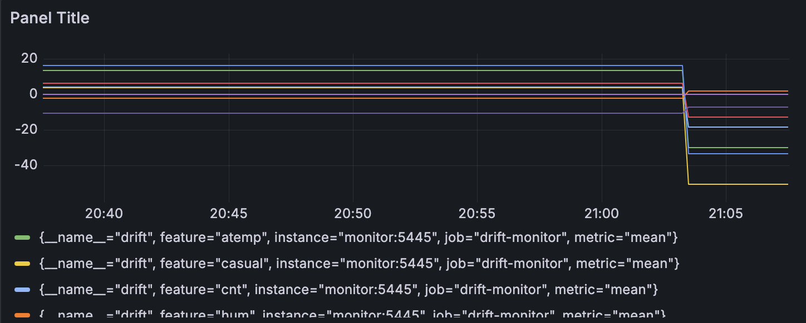
4. Проверяем что алерты загарелись в Grafana, и ждем их в Telegram
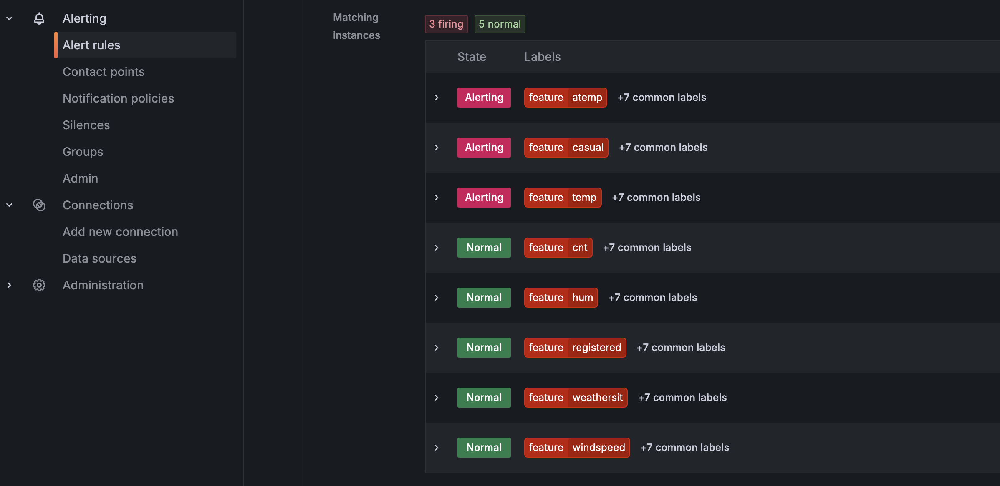
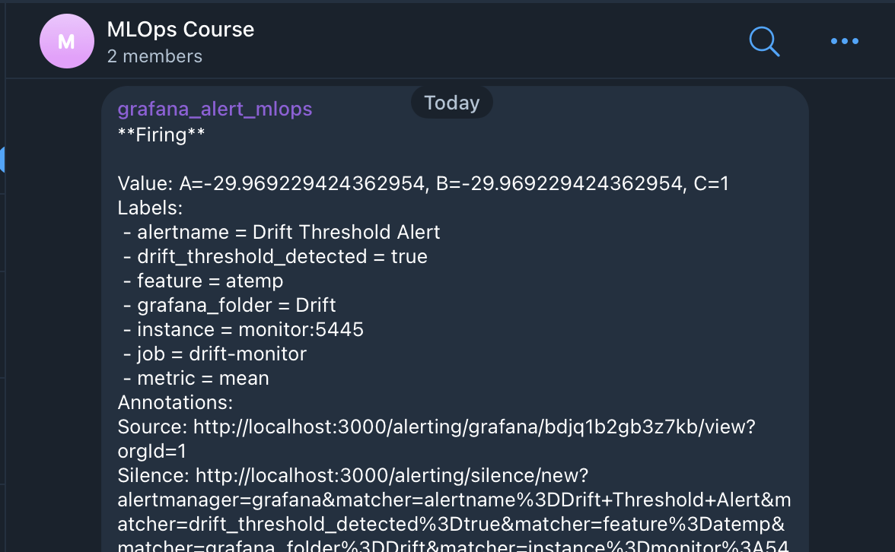